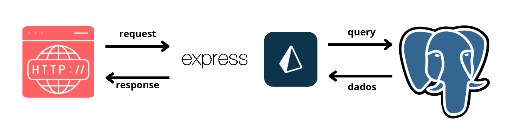

# RESTFUL API CRUD com Prisma

<div style="display:flex; justify-content: space-between; border:1px dashed aliceblue; border-radius: 5px; padding: 8px;">


</div>

---

# O Projeto
Uma Rest API de uma base de dados de livros

O objetivo principal é desenvolver as funcionalidades básicas de uma API interligada a um Banco de Dados



---

<h3 style="border:1px dashed aliceblue; padding: 6px; margin: 0; display:flex; justify-content: space-between; align-items: center;  border-radius: 5px;">
<span>Prisma</span>

</h3>

---

O prisma é um ORM (Object-Relational Mapping - Mapeamento Relacional de Objetos) que é utilizada para facilitar o uso de Bancos de Dados Relacionais (ou não, no caso do MongoDB).

ele auxilia a comunicação da sua aplicação com o banco de dados, facilitando o uso principalmente da linguagem SQL.

E com apoio da Linguagem de Programação Typescript que oferece

O Prisma vai transformar um código nesse modelo:
```` prisma
model Livros {
  id				Int		@id @default(autoincrement())
  titulo			String
  autor				String?
  ano_de_publicacao	Int?
}
````

Em algo semelhante a isso em SQL:
``` sql
CREATE TABLE Livros (
	id INT NOT NULL AUTO_INCREMENT,
	titulo VARCHAR NOT NULL,
	autor VARCHAR
	ano_de_publicacao VARCHAR
);
```

[... Para Saber Mais Sobre o Prisma](https://www.prisma.io/)